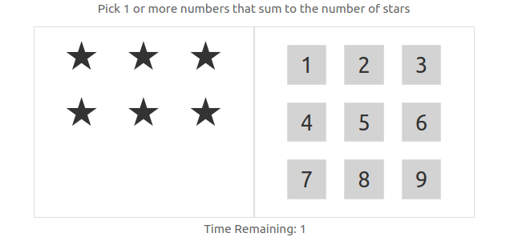
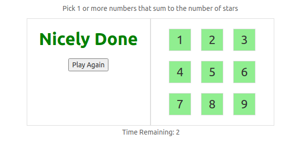
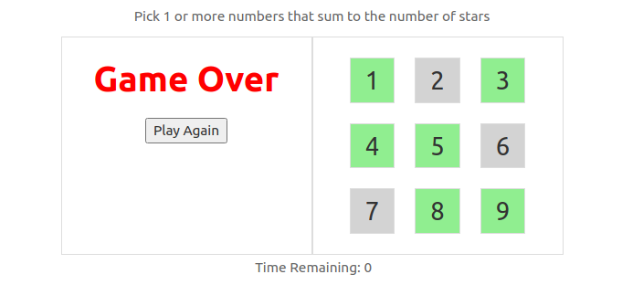

# Play Nine

👉 [Try now](https://raju4789.github.io/play-nine/)

A fast-paced mental-math game built with modern React. Match the number of stars by selecting one or more digits before the timer runs out, clear the board to win, and chase the best remaining-time score.

## Features
- React 18 + hooks implementation packaged with Create React App.
- Dynamic star target generation that always guarantees a playable move.
- Visual feedback for available, candidate, wrong, and used numbers.
- Countdown timer, per-round score, and persistent high-score tracking.
- Instant replay support to jump back into a new round.

## Gameplay

[Read the full game rules](GAME_RULES.md)
1. Nine numbers (1–9) are available along the right.
2. Match the number of stars shown on the left by selecting one or more numbers whose sum equals the star count.
3. Correct picks become “used” and are removed from future rounds; over-shooting the sum turns numbers red so you can adjust.
4. Finish before the 10 second timer hits zero to win. Remaining time becomes your score and updates the high score when you set a new record.







## Tech Stack
- React 18
- Create React App (`react-scripts`)
- Font Awesome icons
- Lodash utilities

## Getting Started

### Prerequisites
- Node.js 18 or newer (tested on Node 22)
- npm 8+

### Installation
```bash
git clone https://github.com/raju4789/play-nine.git
cd play-nine
npm install
```

### Local development
```bash
npm start
```
The app runs at `http://localhost:3000/`. If port 3000 is taken, you can set a custom port: `PORT=4000 npm start`.

### Tests
```bash
npm test -- --watchAll=false
```

### Production build
```bash
npm run build
```
Outputs an optimized bundle in the `build/` directory.

## Deployment

This project is prepped for GitHub Pages via the `gh-pages` package.

1. Update the `homepage` field in `package.json` (already set to `https://raju4789.github.io/play-nine/`).
2. Deploy with:
   ```bash
   npm run deploy
   ```
3. Enable GitHub Pages on the `gh-pages` branch in the repository settings.

For detailed instructions, optional automation, and tips on deploying multiple apps, see [`DEPLOYMENT.md`](DEPLOYMENT.md).

## Roadmap
- Leaderboard with historic scores.
- Difficulty settings (longer timer, additional numbers).
- Progressive web app enhancements.

## Contributing
Pull requests and feature ideas are welcome. Please open an issue to discuss substantial changes or roadmap items before submitting a PR.

## License
No explicit license is provided. If you plan to use this project beyond personal experimentation, please contact the author.
